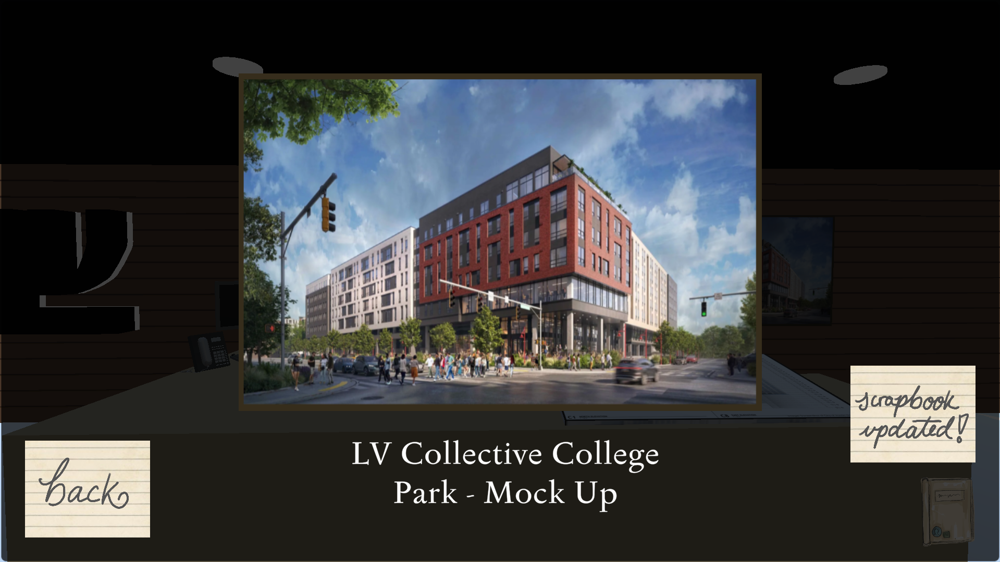

**8135 Baltimore Avenue** is an immersive digital exhibit about the redevelopment of Campus Village Shoppes. Shapeshifting between the visual styles of photogrammetry, 3D modeling, and 2D illustration, this exhibit captures the memories, speculations, and current events of the plaza from the perspective of College Park students. The exhibit was built in Unity for Windows PC in collaboration with Lara Geis and Danika Perez.

*Poster by Lara Geis for our project exhibition on May 3, 2024*

### Screenshots

---

*Completed Spring 2024 for IMDM390 Collaborative Studio II: Experiential Computing. Instructor: Yael Inbar.*

