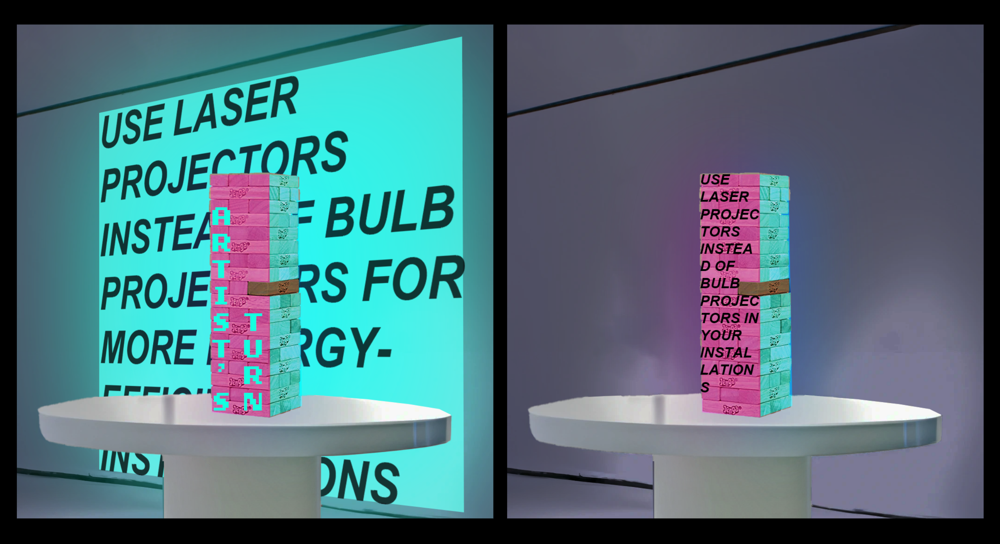

**PLEASE UNPLUG THIS INSTALLATION WHEN NOT IN USE** is an interactive projection mapping installation about balancing institutional and individual responsibility for the climate crisis. I conceptualized this installation during IMDM350 and have submitted this proposal to the Immersive Media Design New Works Incubator to fully develop over the summer.

## PROJECT PROPOSAL
<iframe src="https://docs.google.com/document/d/e/2PACX-1vSK-eNy55pha2oWXqy0abHh5M3vMg2t9RPI7jt_qG-dQcjir3ObeO9W3D6ztZ9LkCwxmQkebrmMmnIs/pub?embedded=true"></iframe>

## PROTOTYPE
Our assignment for the IMDM390 final project was to create a prototype of a project idea we had proposed in a previous assignment. I prototyped the visuals and logic using Processing. Below is a video demonstration.

[Source code](assets/media/pls-unplug-src.txt){:target="_blank"}

<iframe src="https://drive.google.com/file/d/1VtDD5KPkAottmrMoMk8S44d4hQXIWDeW/preview" width="640" height="480" allow="autoplay"></iframe>
   
## CONCEPT ART
To present my project pitch to the class, I created two concepts for how the installation would be executed, using Photoshop with assistance from DALL-E.  

---

*Completed Fall 2023 for IMDM350 Advanced Digital Media Theory. Instructor: Dr. Jason Farman.*

